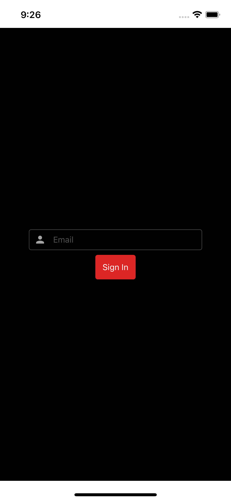
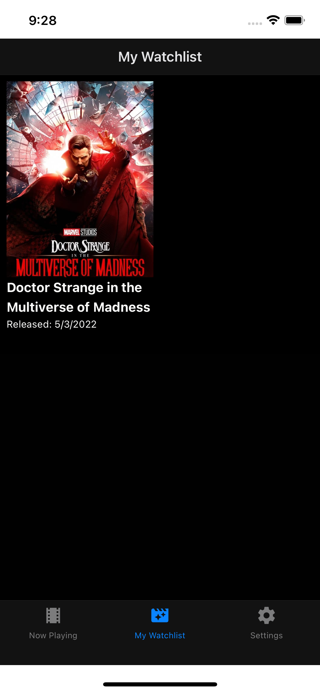
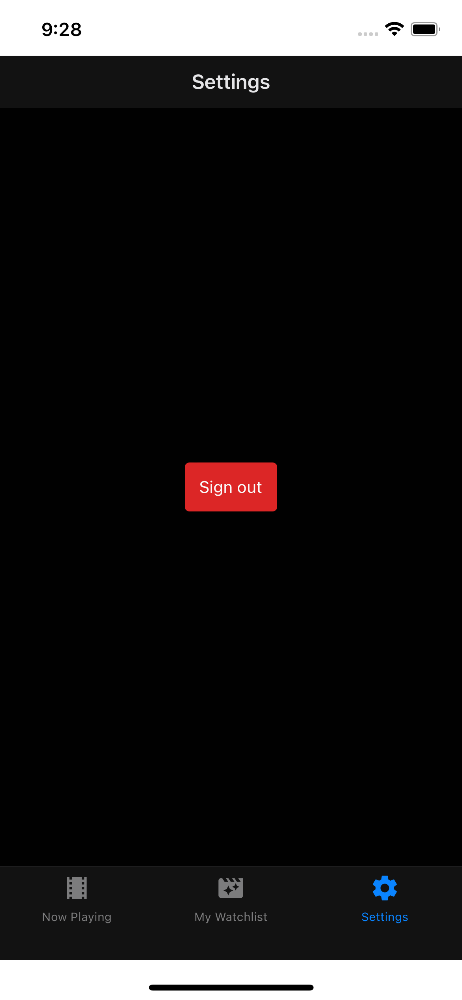

# tmdb-watchlist-prisma

This app uses TMDB to retrieve a list of Now Playing movies.  You can add/remove movies to track which ones you've watched.  There's a "fake" auth flow as well to show navigation as well as tRPC middleware.

Simple app that showcases the following technology.

Expo + tRPC + Prisma + NextJS + Nx + zod + react-hook-form + solito

## Setup

Add your database and TMDB bearer token (instructions [here](https://www.themoviedb.org/documentation/api?language=en-US)) to the `.env` file.  If you aren't using Postgres, make the appropriate changes to the Prisma schema.

If you use Postgres, we setup for you a docker image so you can start right away
Run `docker compose up` to start the PostgreSQL database (Assuming you have the docker deamon installed)

Run `yarn prisma:codegen` and `yarn prisma:migrate` to setup the DB and generated client.

## Running the App

### Run the API

`nx serve next-app`

### Run the App

`nx run-ios mobile`

### Screenshots

